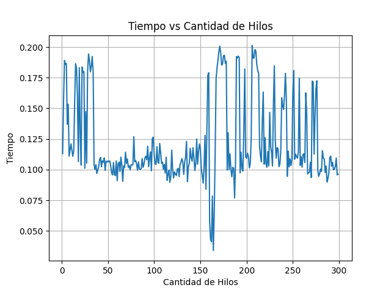
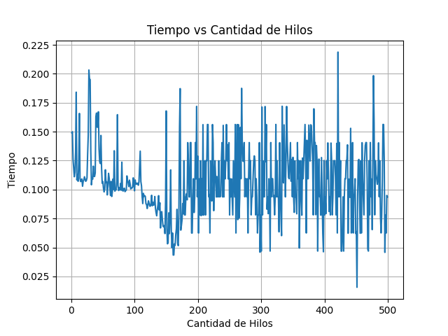
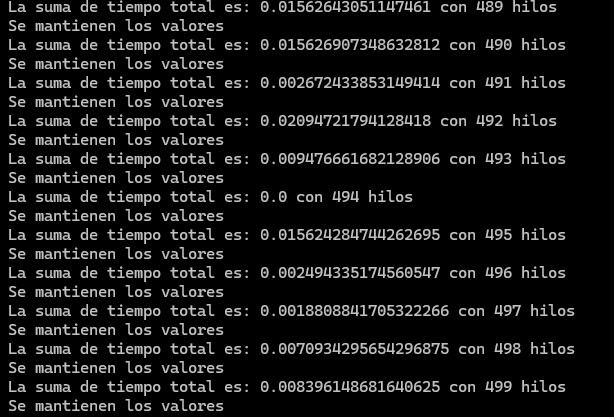

Aumentando la cantidad de hilos, el tiempo tiende a disminuir; en mi caso, a medida que se aumentaban los hilos, el tiempo seguía una tendencia a la baja. Sin embargo, llegaba un punto donde los registros de los tiempos se volvían inestables, y los resultados no mostraban un patrón claro.

Se probó con un vector de 1_000_000 elementos, con 300 y 500 hilos y la tendencia fue clara: el rendimiento dejaba de mejorar a partir de unos 150 hilos, momento en el cual la región inestable iniciaba. Se utilizó un conjunto de un millón de datos, ya que si se utilizaba uno menor, el tiempo era tan pequeño que no se podía apreciar la diferencia entre los tiempos de ejecución.





Para solucionar el tema del ordenamiento, se puede agregar un '.sort()' al final de la función 'ordenar_vector'. Esto ordenaría el vector grande, el cual parece estar compuesto de varios subvectores ordenados. Sería interesante analizar si el tener estas secciones subordenadas afecta positivamente el tiempo de ejecución del ordenamiento final.

En cuanto a la verficación de si los valores son los mismos después de ordenar, se puede hacer una comparación entre el vector original y el vector ordenado. En este caso, el resultado indicó que los valores eran los mismos.

```python
(
    print("Se mantienen los valores")
    if vector_ordenado.sort() == vector_grande_copia.sort()
    else print("Los valores no se mantienen")
)
```

